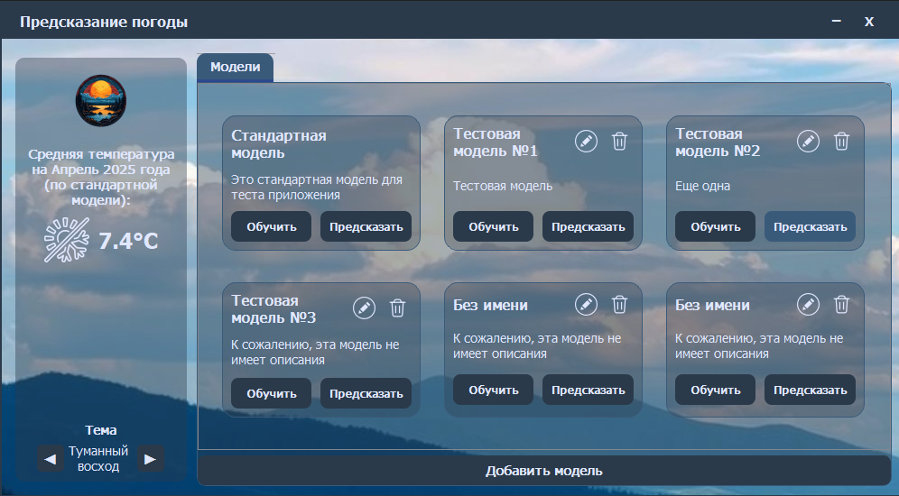
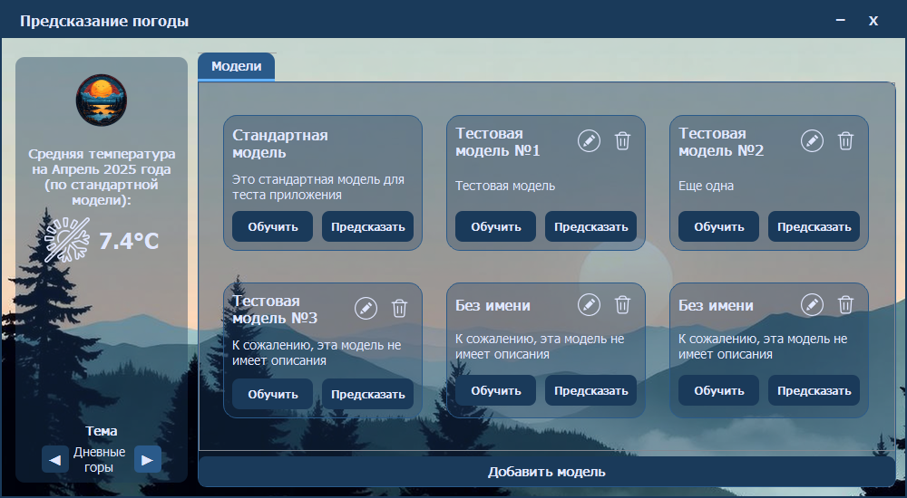
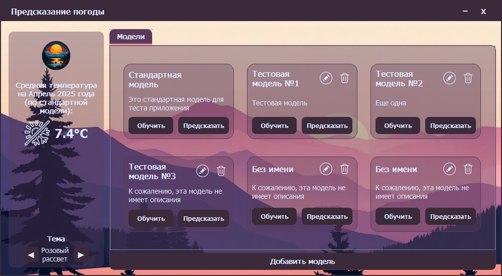
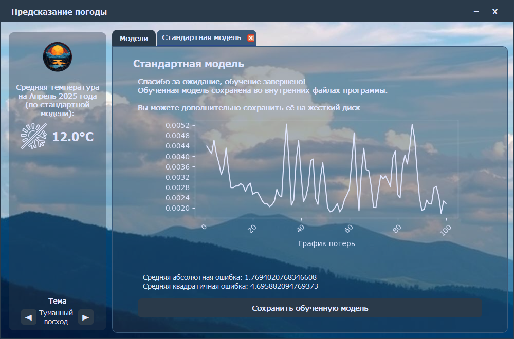
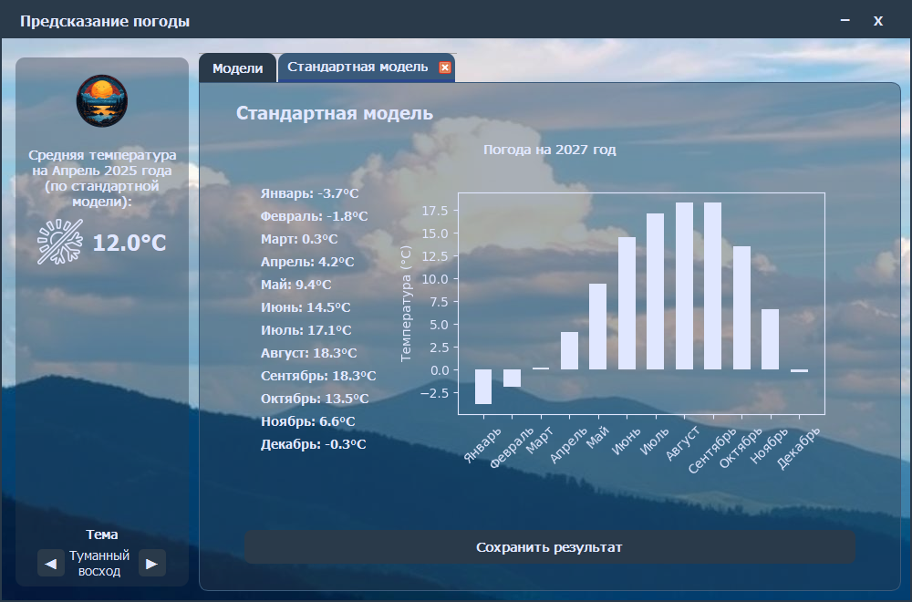

# Предсказатель погоды


**Weather Prediction** — это проект, разработанный для предсказания среднемесячной температуры на 2025 и последующие года с использованием нейросети, основанной на библиотеке `TensorFlow` и `Keras`. Проект включает обучение модели на исторических погодных данных за 2014–2024 годы и графическое приложение на `PyQt5` для удобного взаимодействия с моделью, визуализации результатов и управления обучением.


## Цели проекта
1. **Обучение модели**: Разработать и обучить нейронную сеть для предсказания среднемесячной температуры на основе исторических данных с высокой точностью;
2. **Приложение**: Создать графическое приложение для загрузки данных, обучения модели, предсказания температуры и визуализации результатов в виде диаграмм.


## Возможности
- Предсказание среднемесячной температуры на 2025-2030 год с использованием обученной нейронной сети.
- Графический интерфейс на `PyQt5` с поддержкой:
  - Загрузки своих исторических данных из файлов `.txt` или `.csv`;
  - Обучение модели на стандартном наборе данных (`.keras`);
  - Визуализации предсказанных температур в виде гистограммы (X — температура, Y — месяц);
  - Отображения графика потерь обучения (X — эпоха, Y — потери);
  - Сохранения обученной модели и предсказаний в файлы;
  - Переключения тем оформления («Туманный восход», «Дневные горы» и «Розовый рассвет»);
  - Управления моделями (добавление, изменение имени/описания и их удаление).
- Поддержка кастомизации интерфейса через файл стилей `styles.py`.

## Структура проекта

- **`main.py`**: точка входа в приложение;
- **`ui.py`**: логика пользовательского интерфейса;
- **`logic.py`**: бизнес-логика приложения (обучение, предсказание, управление моделями);
- **`config.py`**: конфигурационные параметры;
- **`styles.py`**: стили для интерфейса;

- **`src/`**:

  - `assets/`:
    - `misty_sunrise_background.png`, `pink_dawn_background.png`, `daylight_mountains_background.png`: фоновые изображения;
    - `main_logo.png`: логотип приложения;
    - `temperature_icon.svg`, `change_icon.svg`, `trash_icon.svg`: иконки для интерфейса.

  - `data/`:
    - `Temperature20142024MoscowVDNH.txt`: файл со стандартным набором данных для обучения.

  - `models/`:
    - Файлы моделей (`.keras`), в том числе и стандартной для тестов приложения.

  - `models.json`: файл с названиями и описаниями моделей для их карточек в приложении.

- **`requirements.txt`**: зависимости для приложения.
- **`.gitignore`**: файл для исключения ненужных файлов.
- **`LICENSE`**: лицензия проекта — GNU General Public License 3.0 (GPL-3.0).


## Исходные данные

### Обученная модель
- Модель сохранена в папку `src/models/` и доступна в виде файла `bc60fe9b-68a6-41cc-8b86-39cf66bf0af4.keras`.

- Данные для стандартной модели из файла `Temperature20142024MoscowVDNH.txt` взяты с сайта [«Расписание погоды».](https://rp5.ru/)

## Установка и запуск

### Требования
- Python 3.11.
- Локальная среда для запуска приложения (Windows).

### Запуск приложения
1. Установите зависимости:
    ```bash
    pip install -r requirements.txt
    ```
2. Запустите приложение:
    ```bash
    python main.py
    ```


## Принцип работы

### Приложение
Приложение предоставляет графический интерфейс:
1. Вкладка «Модели» для управления моделями (добавление, удаление, изменение имени/описания);
2. Возможность обучения модели на стандартных или пользовательских данных;
3. Визуализация результатов предсказания в виде гистограммы;
4. Отображение графика потерь обучения;
5. Сохранение предсказаний в `.txt` или `.csv`;
6. Смена тем оформления через боковую панель;
7. Отображение температуры для текущего месяца на боковой панели.

## Скриншоты

### Главное окно приложения с темой по умолчанию («Туманный восход»)


### Тема «Дневные горы»


### Тема «Розовый рассвет»


### Вкладка обучения модели


### Вкладка предсказания модели


## Лицензия
Этот проект распространяется под лицензией [GNU General Public License 3.0 (GPL-3.0)](LICENSE).

### Примечание об использовании
Хотя этот проект лицензирован под GPL-3.0, автор просит пользователей воздержаться от коммерческого использования без предварительного согласования. Если вы хотите использовать проект в коммерческих целях, пожалуйста, свяжитесь со мной: <vikazlobova@yandex.ru>.
